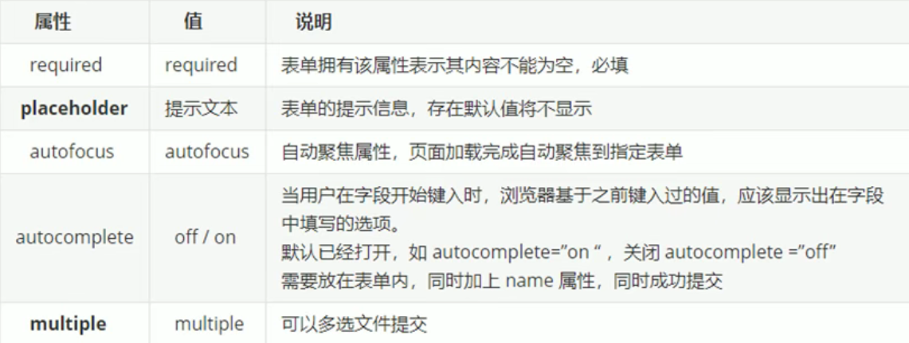

##### 1 语义化标签

- 这些语义化标签主要用在搜索引擎中
- 这些标签在页面中可以多次使用
- `IE9`中需要将这些元素转为块级元素
- 移动端会更喜欢这些新的语义化标签

```css
<header>    头部标签
<nav>       导航标签
<article>   内容标签
<section>   定义文档某个区域
<aside>     侧边栏标签
<footer>    尾部标签
```

##### 2 视频标签

```css
<video src="文件地址"></video>
/*兼容性写法*/
<video width="320" height="240" controls>
  <source src="movie.mp4" type="video/mp4">
  <source src="movie.ogg" type="video/ogg">
您的浏览器不支持Video标签。
</video>
```


##### 3 音频标签

```css
/*谷歌禁用了自动播放*/
<audio src="文件地址"></audio>
/*兼容性写法*/
<audio controls loop>
  <source src="horse.ogg" type="audio/ogg">
  <source src="horse.mp3" type="audio/mpeg">
  您的浏览器不支持 audio 元素。
</audio>
```


##### 4 input类型


##### 表单属性



