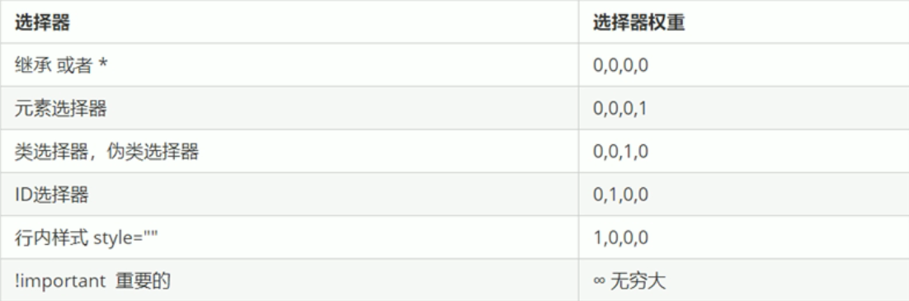

##### 1 层叠性

给相同的选择器设置相同的样式此时样式就会覆盖，层叠性主要为了解决样式的冲突。

##### 2 继承性

字标签会继承父标签的某些样式，比如文本的颜色和字号。

- 恰当的使用继承性可以简化代码，降低`CSS`的复杂性
- 子元素只能继承某些属性：`text- font- line-`等开头的属性以及`color`属性

##### 3 优先级

当给同一个元素指定了多个选择器就会有优先级的产生，选择器相同则执行层叠性，选择器不同则根据选择器权重执行。



```css
.test {
    color: pink
}
div {
    color: red
}
/*.test选择器会生效，因为类选择器的样式比元素选择器要高*/
<div class="test">测试</div>
```

```css
p {
    color: pink
}
#test {
    color: red
}
/*
p选择器会生效，因为<p>标签上有两个样式：从id为test的div上继承的color: red 和 p选择器的color: pink
但是继承得到的权重是0.0.0.0，而p选择器的权重是0.0.0.1，所以p选择器的优先级较高。就算在#test选择器上加上!important继承得到的权重依旧是0.0.0.0
*/
<div id="test">
	<p>测试</p>
</div>
```

**CSS权重的叠加**：如果是复合选择器，则会有权重的叠加，此时就需要计算权重。

注意：权重可以叠加，但是永远不会进位

```css
li {
    color: red
}
ul li {
    color: green
}
.test li {
    color: pink
}
/*li的权重为0.0.0.1；ul li的权重为0.0.0.2；.test li的权重为0.0.1.1。所以.test li选择器会生效*/
<ul>
    <li>111</li>
    <li>222</li>
    <li>333</li>
</ul>
```

