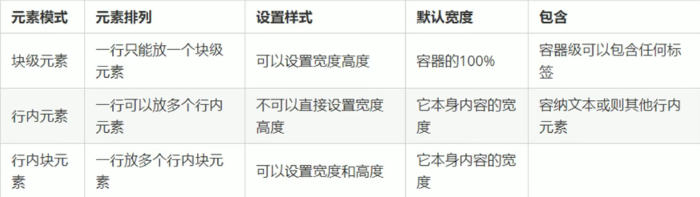

##### 1 什么是元素的显示模式

元素模式就是元素(标签)以什么方式进行显示，比如`
`自己占一行，比如一行可以放多个``。HTML元素一般分为**块元素**和**行内元素**两种类型。

##### 2 块元素

常见的块元素有`<h1>~<h6> 
 
 <ul> <ol> <li>` 等，其中`
`标签是最经典的块元素。

块元素的特点：

- 独占一行

- **高度、宽度、外边距以及内边距都可以控制**

- 宽度默认是容器（父级宽度）的100%

- 是一个容器及盒子，里面可以放行内或者块级元素

注意

- 文字类的元素内不能使用块级元素

- `
 `标签主要用于存放文字，因此`
`里面不能放块级元素，特别是不能放`
`

- 同理，`<h1>~<h6>`等都是文字类块级标签，里面不能放其他块级元素

##### 3 行内元素

常见的行内元素有`<a> <strong> <b> <em> <i> <del> <s> <ins> <u> `等，其中``标签是最典型的行内元素。有的地方也将行内元素称为内联元素。

行内元素特点：

- 相邻行内元素在一行上，一行可以显示多个
- 高宽直接设置是无效的
- 默认宽度就是它本身内容的宽度
- 行内元素只能容纳文本或其他行内元素

注意：

- 链接里面不能再放链接
- 特殊情况链接`<a>`里面可以放块级元素，但是给`<a>`转换为块级模式最安全

##### 4 行内块元素

在行内元素中有几个特殊的标签` <input> <td>`，他们同时具有块元素和行内元素的特点。

行内块元素的特点

- 和相邻行内块元素在一行上，但是他们之间会有空白缝隙，一行可以显示多个
- 默认宽度就是它本身内容的宽度
- 高度、宽度、外边距以及内边距都可以控制

##### 5 元素显示模式小结

##### 6 元素显示模式的转换

特殊情况下，我们需要元素显示模式的转化。简单理解：一个模式的元素需要另一种模式的特性，比如想要增加标签`<a>`的触发范围。

- 转化为块元素：`display：block`
- 转换为行内元素：`display：inline`
- 转换为行内块元素：`display：inline-block`
