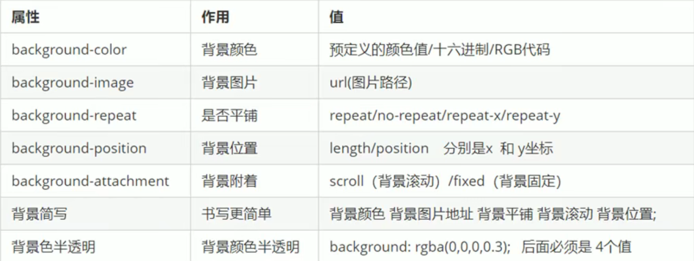

##### 1 背景色

- 默认值为`transparent`，即透明色
- 也可以手动设置为透明色

```css
/*将p标签的背景设置为灰色*/
p {background-color: gray;}
```

##### 2 背景图片

描述了元素的背景头像，实际开发中常用于`logo`及一些装饰性的小图片或是超大的背景图片，优点是便于控制位置。

```css
div {background-image: url(/img.gif);}
```

```css
/*修改背景图片的尺寸，单位可以是长度单位或百分比(如果只写一个则为设置宽度)等
  cover：完全覆盖，图片比例不变，可能会造成图片的显示不全
  contain:覆盖，图片比例不变，可能会造成盒子有空隙*/
div {background-size: width height;}
```

##### 3 背景平铺

如果需要对背景进行平铺，可以使用`background-repeat`属性进行设置。

- `repeat`：平铺（默认）
- `no-repeat`：不平铺
- `repeat-x`：横向平铺（横向复制）
- `repeat-y`：纵向平铺（纵向复制）

```css
div {
    background-image: url(logo.jpg);
    background-repeat: repeat-y;
}
```

##### 4 背景图片位置

利用`background-position: x y`可以改变图片在背景中的位置，参数`x y`的意思是`x坐标系`和`y坐标系`，可以使用**方位名词**或**精确单位**。

- 方位名词：`top center bottom | left center right`（不区分顺序，如果只指定了一个则另一个默认是`center`）

- 精确单位：百分数或由浮点数和单位组成的长度值（第一个值为x坐标第二个值为y坐标；如果只指定一个则一定是x坐标，y坐标默认居中）

- 混合单位：第一个值一定是x坐标，第二个值一定是y坐标

##### 5 背景附着

`background-attachment: scroll | fixed`属性设置背景图像是否固定或跟随页面其余部分滚动，可以制作视差滚动效果。

- `scroll`：背景图像随着对象内容滚动（默认）
- `fixed`：背景图像固定

##### 6 复合写法

上述五个属性可以复合在同一个属性`background`中，当使用复合属性时没有特定的书写顺序，一般习惯约定顺序为：

```css
background: 背景颜色 背景图片地址 背景平铺 背景附着 背景图片位置
```

 ##### 7 背景色半透明

`CSS3`为我们提供了背景色半透明的效果。注意只是将盒子的背景色设置为半透明，盒子里面的内容不受影响。

```css
/*前三参数即为rbg色准；最后一个参数为alpha透明度，取值在[0,1]之间，0为全透明，1为不透明*/
background: rgba(0, 0, 0, .3)
```

##### 8 小结


