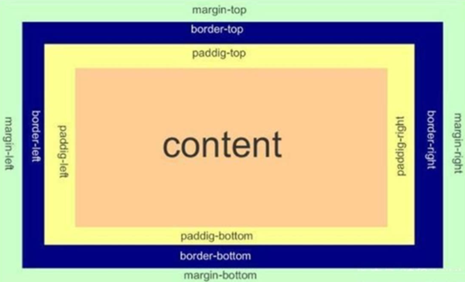
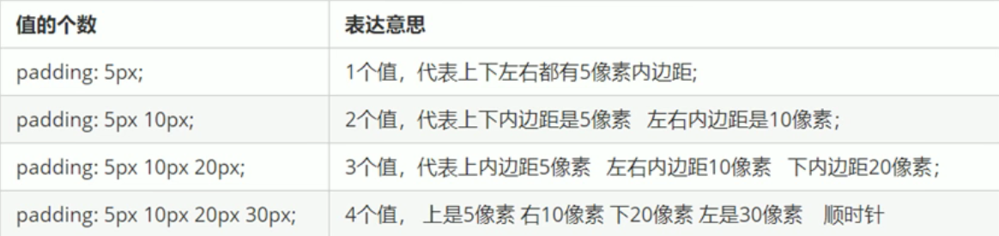
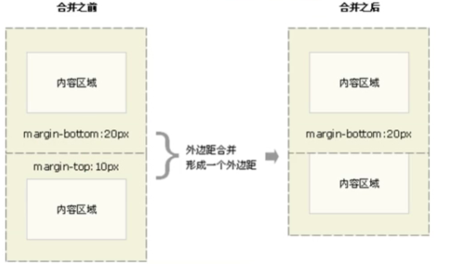
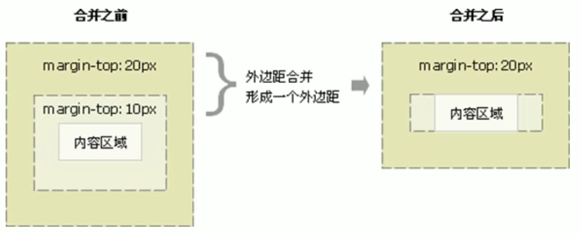

##### 1 盒子模型组成

所谓盒子模型就是将页面中的元素看做是一个矩形的盒子，也就是一个盛装内容的容器，包括边框、外边框、内边距和实际内容。



##### 2 边框

`border`可以用来设置盒子的边框，边框有三部分组成：边框粗细、边框样式、边框颜色。

```css
/*可以直接使用 border 复合属性，顺序没有要求。也可以分开写*/
/*使用 border-top 属性单独设置上边框，其余同理*/
border: border-width || border-style || border-color
```

- `border-width`：定义边框粗细，单位为`px`
- `border-style`：边框的样式
    - `none`：无边框（默认）；`solid`：实线边框；`dashed`：虚线边框；`dotted`：点线边框
- `border-color`：边框颜色

##### 3 表格的细线边框

`border-collapse`属性可以控制浏览器绘制表格边框的样式，可以控制相邻单元格的边框。

```css
/*将相邻单元格的边框合并*/
border-collapse: collapse
```

##### 4 内边距

`padding`属性用于设置内边距，即边框与内容之间的距离

- 单独属性：通过`padding-left`等四个属性单独设置内边距
- 复合属性



注意：`padding`等属性设置内边距时会影响到盒子的实际大小，此时原本的盒子就会被撑大，如果要保持盒子大小不变就需要将盒子原本的大小减去内边距的值。但是如果盒子本身没有指定`width/height`属性，此时`padding`等属性就不会影响到盒子的大小（即使设置为`100%`）。

##### 5 外边距

`margin`用于设置外边距，即盒子与盒子之间的距离

- 单独属性：通过`margin-left`等四个属性单独设置外边距
- 复合属性：和`padding`完全一致

应用：外边距可以让块级盒子水平居中，但是必须满足两个条件

1. 盒子必须指定了宽度
2. 将盒子的左右外边距都设置为`auto`
- 如果想让行内元素或行内块元素居中：给父元素添加`text-align: center`即可

##### 6 外边距合并

使用`margin`设置块元素的外边距时可能会出现**外边距的合并**

1. **相邻块元素垂直外边距的合并**

    当上下相邻的两个块元素（兄弟关系）相遇时，如果上面的元素有下外间距，下面的元素有上外间距，但他们的垂直间距不是上下间距的和，而是取上下间距中较大的一方，这种现象称为相邻块元素垂直外边距的合并。解决方案：尽量只个一个盒子添加外边距。

    

2. **嵌套块元素垂直外边距的塌陷**

    对于两个嵌套（父子关系）的块元素，父元素有上外边距，子元素也有上外边距，此时父元素会塌陷较大的外边距值。

    解决方案：

    1. 为父元素定义上边框
    2. 为父元素定义上内边距
    3. 为父元素添加`overflow: hidden`
    4. 有浮动、固定定位、绝对定位的盒子不会有塌陷问题



##### 7 清除内外边距

很多网页元素都带有默认的内外边距，而且不同浏览器默认的内外边距并不一致，因此我们在布局前需要先清除网页元素的内外边距。

```css
* {
    padding: 0;
    margin: 0;
}
```

行内元素为了照顾兼容性，尽量只设置左右内外边距，而不要设置上下内外边距，但是转换为块级元素或行内块元素就可以了

