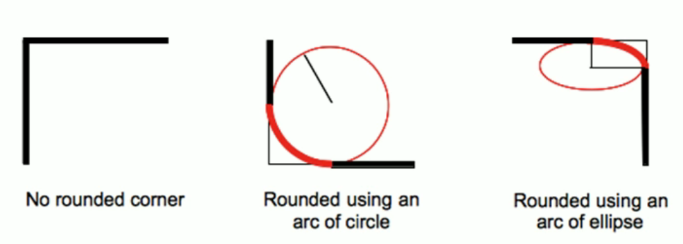
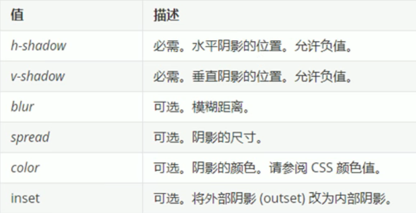
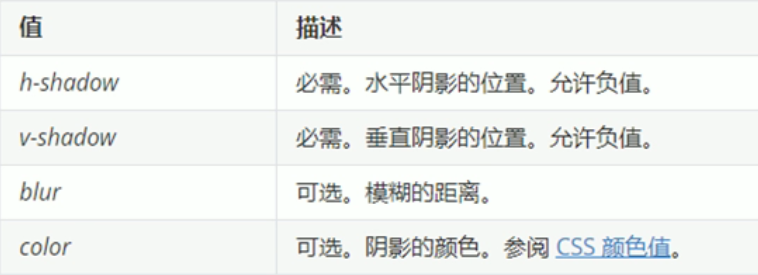

##### 1 圆角边框

`CSS3`中增加了`border-radius`属性设置元素的边框圆角样式

- 参数值可以为数值或百分比表示
- 如果盒子是一个正方形想要设置成圆形，将数值改为高度或宽度的一半即可，或直接写为50%
- 如果盒子是一个矩形，设置为高度的一半就可以做成圆角矩形
- 该属性是一个简写属性，可以写四个数值分别代表左上角、右上角、右下角、左下角
- 分开写即为：`border-top-left-radius`等

```css
border-radius: length
```



##### 2 盒子阴影

`CSS3`中增加了`box-shadow`属性设置盒子的阴影

```css
box-shadow: h-shadow v-shadow blur spread color inset
```



##### 3 文字阴影

`CSS3`中增加了`text-shadow`属性设置盒子的阴影

```css
text-shadow: h-shadow v-shadow blur color
```

