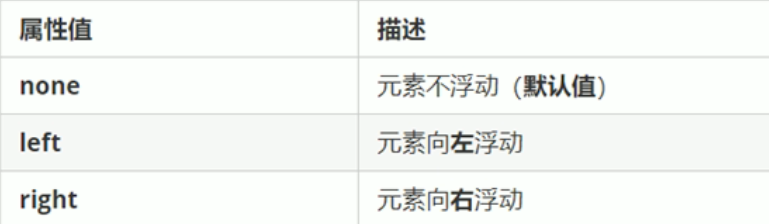
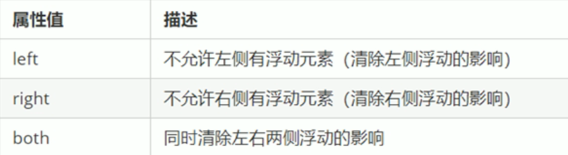
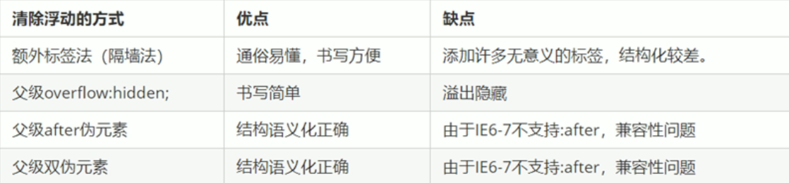

##### 1 为什么需要浮动

有很多的布局方式使用标准流无法完成，此时就可以使用浮动完成布局，因为浮动可以改变元素标签的默认排列方式。

- 最经典的应用：使多个块级元素在一行内排列显示

- 网页元素第一准则：多个块级元素纵向排列找标准流，多个块级元素横向排列找浮动

##### 2 什么是浮动

`float`属性用于创建浮动框，将其移动到一边，直至左边缘或右边缘触及包含块或另一个浮动框的边缘

```css
float: 属性值
```



##### 3 浮动的特性

1. 浮动元素会脱离标准流，并且不再保留原先的位置
2. 浮动元素会一行内显示并且元素顶部对齐，如果父级元素宽度无法容纳这些元素，多出的元素会另起一行显示
3. 浮动的元素会具有行内块元素的特性（可以设置宽度）

##### 4 清除浮动

为什么要清除浮动：父盒子在很多情况下不方便直接给高度，但是如果盒子里面的元素浮动，由于浮动元素不占用原文档流的位置，父盒子的高度会坍塌为`0`，此时就会影响到父盒子下面的标准流盒子

清除浮动的本质

- 清除浮动的本质是清除浮动元素造成的影响
- 如果父元素有高度，则不需要清除浮动
- 清除浮动之后父元素就会根据内部浮动元素自动检测高度，父元素有了高度后就不会影响下面的标准流盒子了

```css
/*实际开发中基本只使用：both属性值*/
clear: 属性值
```



清除浮动的策略：**闭合浮动**，只让浮动在盒子内部，而不影响盒子外部的元素

清除浮动的方法：

1. 额外标签法，也称为隔墙法（W3C推荐）

    在浮动元素默认添加一个空标签，如：`<div style="play: both"></div>`或`<br style="play: both" />`等元素，但是只能是块级元素，但是会添加无意义的标签，结构化较差。

2. **父元素**添加`overflow`属性，将其设置为`hidden` 、`auto`或`scroll`

    缺点是无法显示溢出的部分

3. **父元素**添加`:after`伪属性

    相当于是额外标签法的升级版。优点是无需写额外的标签、结构更简单。缺点是需要照顾低版本浏览器。百度、淘宝、网易等公司使用该方法

    ```css
    /*通常使用clearfix作为父元素的class属性来定位到父元素*/
    父元素:after {
        content: "";
        display: block;
        height: 0;
        clear: both;
        visibility: hidden;
    }
    
    父元素 {
        /* IE6、7 专有 */
        *zoom: 1;
    }
    ```

    

4. **父元素**添加双伪属性

    也是额外标签法的升级版。优点是无需写额外的标签、结构更简单。缺点是需要照顾低版本浏览器。小米、腾讯等公司使用该方法

    ```css
    父元素:before,
    父元素:after {
        content: "";
        display: table;
    }
    
    父元素:after {
        clear: both;
    }
    
    父元素 {
        *zoom: 1;
    }
    ```

