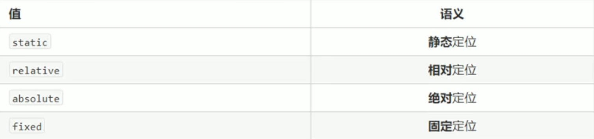
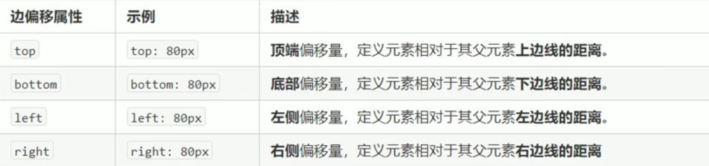
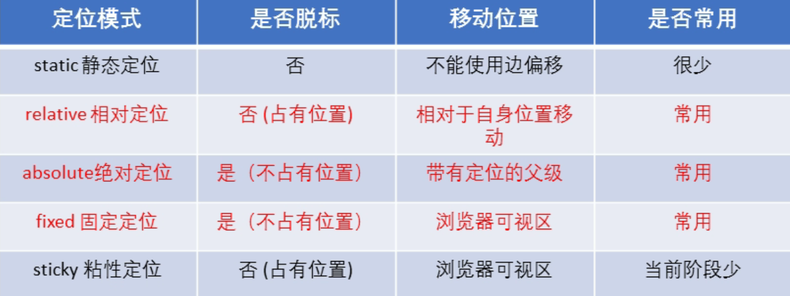

##### 1 为什么需要定位

定位可以让盒子自由的在某个盒子内部移动位置或固定在屏幕中的某个位置。并且可以盖住其他盒子

`定位 = 定位模式 + 边偏移`

`定位模式`：指定一个元素在文档中的定位方式



`边偏移`：决定了该元素在定位模式下的最终位置，有`top left right bottom`四个属性



##### 2 静态定位 posttion （了解）

静态定位是元素默认的定位方式，按照标准流的特性摆放位置，没有边偏移

```css
position: static
```

##### 3 相对定位  relative （重要）

- 相对定位指元素在移动位置的时是相对于他**原本的位置**来移动
- 元素移动后原来在标准流的位置继续保留，后面的盒子依旧以标准流的方式对待他（不脱标）
- 最典型的应用是为绝对定位服务

```css
posittion: relative
```

##### 4 绝对定位  absolute （重要）

- 绝对定位值元素在移动位置时是按照他的**祖先元素**来说的
- 如果没有祖先元素或祖先元素没有定位，则以浏览器为准定位（`Document文档`）
- 如果祖先元素有定位（相对、绝对、固定），则以最近一级有定位的祖先元素为参考点移动位置
- 绝对定位的元素不再占用原先标准流的位置（脱标）

```css
posittion: absolute
```

##### 5 固定定位  fixed （重要）

- 固定定位指元素固定于浏览器可视区的位置，可以在浏览器滚动时保证元素的位置不会改变
- 以浏览器的窗口为参照点移动元素
- 固定定位的元素不再占用原先标准流的位置（脱标）

```css
posittion: fixed
```

小技巧：固定元素在版心右侧位置

1. 固定定位的盒子`left: 50%`，到达浏览器中心位置（也是版心的中心）
2. `margin-left: 版心宽度的一半`，到达版心右侧边缘

##### 6 粘性定位  sticky （了解）

- 粘性定位可以被看做相对定位和固定定位的混合
- 以浏览器窗口为参照点移动元素（固定定位特征）
- 占有原先的位置（不脱标，相对定位的特点）
- 必须添加`top left right bottom`中的一个才会生效（如`top: 0`在距离浏览器上窗口距离为0时就不会随着窗口的滚动而移动）
- 兼容性较差，`IE`不支持

```css
posittion: sticky
```

##### 7 定位小结



##### 8 定位叠放次序

在使用定位布局时可能会出现盒子重叠的情况，`z-index`属性可以控制盒子的显示优先级

```css
z-index: n
```

- 值可以是正整数、负整数或`0`，默认是`auto`，数值越大盒子越靠上，显示优先级越高
- 如果属性值相同，则按照书写顺序，后来者居上
- 只有定位的盒子才能有`z-index`属性

##### 9 拓展

1. 使绝对定位的盒子居中

    加了绝对定位，固定定位的盒子无法通过`margin: 0 auto`水平居中，但是可以使用`left: 50%; margin-left: -自身宽度的一半`，垂直居中同理

2. 定位的特性

    - 行内元素添加绝对定位或固定定位，可以直接设置高度和宽度
    - 块级元素添加绝对定位或固定定位，如果不给宽度和高度，默认大小是内容的大小

3. 脱标的盒子不会触发外边距塌陷

    浮动元素、绝对定位和固定定位的元素不会触发外边距合并的问题

4. 绝对定位、固定定位会完全压住盒子

    - 浮动元素只会压住下面标准流的盒子，但是不会压住盒子中的文字（浮动产生的目的就是为了做文字环绕效果）
    - 绝对定位和固定定位会完全压住标准流的盒子

##### 10 常用布局

```css
/*固定定位居中；可以去掉left和transform属性*/
.search {
    position: fixed;
    top: 0;
    left: 50%;
    transform: translateX(-50%);
    max-width: 540px;
    min-width: 320px;
    width: 100%;
    height: 44px;
    background-color: pink;
}
```

