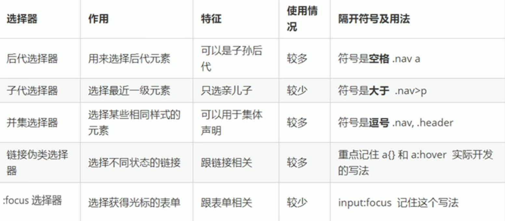

##### 1 后代选择器

元素1 元素2：选中元素1下所有的元素2，元素1和元素2可以是任意的基础选择器

```css
/*选中ol下的所有li*/
ol li {}
```

##### 2 子选择器

元素1>元素2：选中元素1下最近一级的元素2，简单理解为亲儿子元素，元素1和元素2可以是任意的基础选择器

```css
/*选中div下最近一级的a标签*/
div > a {color: pink;}
```

##### 3 并集选择器

元素1, 元素2：选中元素1和元素2的并集，元素1和元素2可以是任何形式的选择器(包括复合选择器)

```css
/*选中所有的div标签和p标签*/
div,
p {}
```

##### 4 伪类原则器

伪类选择器用于向某些选择器添加特殊的效果，比如给链接添加效果，或选择第1个、第n个元素。

###### 4.1 链接伪类选择器

- a:link：选择所有未被访问的链接
- a:visited：选择所有已被访问的链接
- a:hover：选择鼠标指针位于其上的链接，重要
- a:active：选择活动链接(鼠标按下但未松开的链接)
- 注意事项：为确保生效，请按照lvha的顺序声明，请勿改变
- a标签在浏览器中具有默认的样式，需要单独为其指定样式。一般为所有a标签设置颜色并去除下划线，并设置鼠标经过时的颜色

```css
/*设置a标签文字颜色为#333,并去除下划线，鼠标悬浮时颜色变为skyblue*/
a {
    color: #333;
    text-decoration: none;
}
a:hover {
    color: skyblue;
}
```

###### 4.2 :focus伪类选择器

用于选取获得焦点的表单元素。焦点就是光标，一般只有input标签才能获取。

```css
/*选中获得焦点的input标签*/
input:focus {}
```

##### 5 小结


