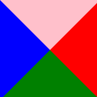

##### 1 CSS三角

网页中常见的三角形可以直接使用CSS画出来，不必做成图片或字体图标

```css
.box {
    width: 0;
    height: 0;
    /*line-height和font-size为了兼容性*/
    line-height: 0;
    font-size: 0;
    border-top: 10px solid pink;
    border-right: 10px solid red;
    border-left: 10px solid blue;
    border-bottom: 10px solid green;
}
<div class="box"></div>
```




