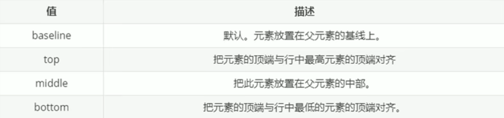
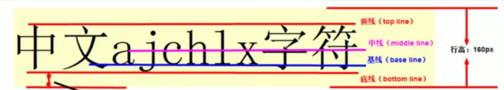

##### 1 使用场景

`vertical-align`属性经常用于设置图片或表单（行内块元素）和文字垂直对齐

官方解释：用于设置一个元素的垂直对齐方式，但是他只针对行内元素或行内块元素生效

```css
vertical-align: 属性值
```





图片和表单都属于行内块元素，默认基线对齐，此时可以给图片或表单的`vertical-align`属性设置为`middle`让文字和图片垂直居中对齐

##### 解决图片底部空白缝隙

因为图片默认和文字的基线对齐，所以底部会留出一部分空白分析，主要解决方案有两种

- 给图片添加添加`vertical-align`添加`middle`、`top`、`bottom`等属性（推荐）
- 将图片转换为块级元素`display: bloc`

