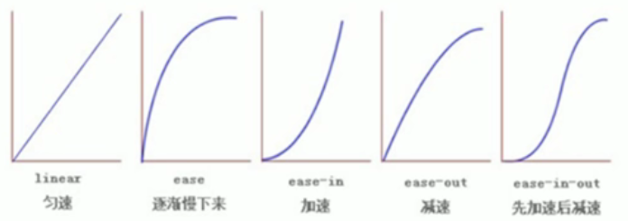

##### 1 过渡（重点）

`transition`是`CSS3`中具有颠覆性的特征之一，使得我们可以在不使用`Flash`动画或`JavaScript`的情况下，在元素从一种样式变成另一种样式时为元素添加效果

- 要过渡的属性：想要变化的CSS属性，背景高度、背景颜色。内外边距等都可以，`all`使所有属性都变化过渡
- 花费时间：单位是秒（必须写单位），如：`.5s`
- 运动曲线：默认是`ease`（可以省略）
- 开始时间：单位是秒（必须写单位），可以设置延时触发时间，默认为`0s`（可以省略）

```css
/*如果要变化多个属性使用,分隔*/
transition: 要过渡的属性 花费时间 运动曲线 开始时间
```



##### 2 图片模糊

`filter`属性将模糊或偏移等图形效果应用于元素

```css
/*如：blur(5px)：模糊处理，数值越大越模糊*/
filter: 函数()
```

##### 3 calc函数

`calc`可以在声明`CSS`属性时执行一些计算

```css
width: calc(100% - 80px)
```

