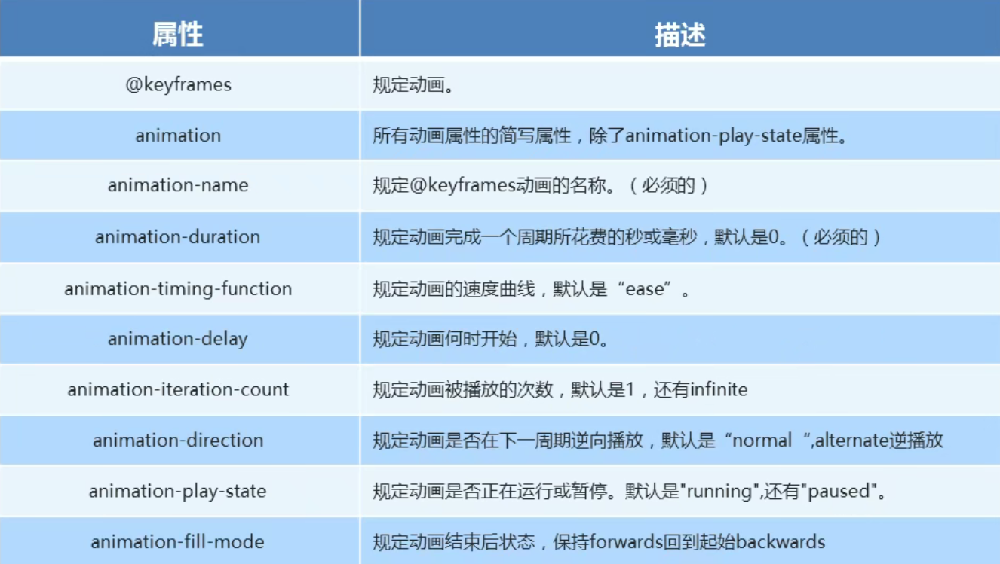

`animation`（动画）是`CSS3`中具有颠覆性的特征之一，可以通过设置多个节点来精确控制一个或一组动画，通常用来实现复杂的动画效果

##### 使用

1. 定义动画

    ```css
    @keyframes 动画名称 {
        /*开始状态，也可以定义为from*/
        0% {
            transform: translateX(0)
        }
        /*结束状态，也可以定义为to*/
        0% {
            transform: translateX(100px)
        }
    }
    ```

2. 使用动画

    ```css
    选择器 {
        animation-name: 动画名称;
        animation-duration: 持续时间;
    }
    ```

##### 常见属性

- 注意速度曲线`animation-timing-function`的特殊值：`step(n)`，n是一个正整数，即整个动画分为n步来完成



##### 综合写法

多个动画可以写多组并使用`","`分隔

```css
animation: 动画名称 持续时间 运动曲线 何时开始 播放次数 是否反向 结束后是否回到起始
```

