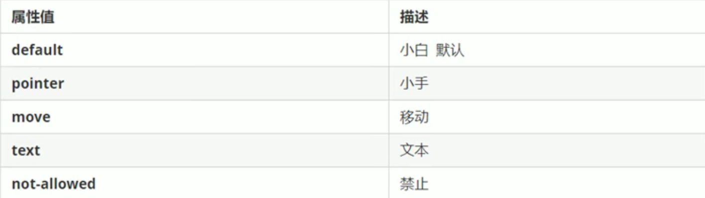

##### 1 鼠标样式 （cursor）

```css
cursor: pointer
```



##### 2 轮廓线 （outline）

文本输入框在获得焦点时会自动加上蓝色的轮廓线，给表单添加`outline: 0`或`outline: none`之后就可以去掉

```css
input {outline: none}
```

##### 3 防止文本域拖拽 （resize）

实际开发中我们会让文本域无法拖拽（也可以使用`outline: none`去掉轮廓线）

 ```css
 textarea {resize: none}
 ```


