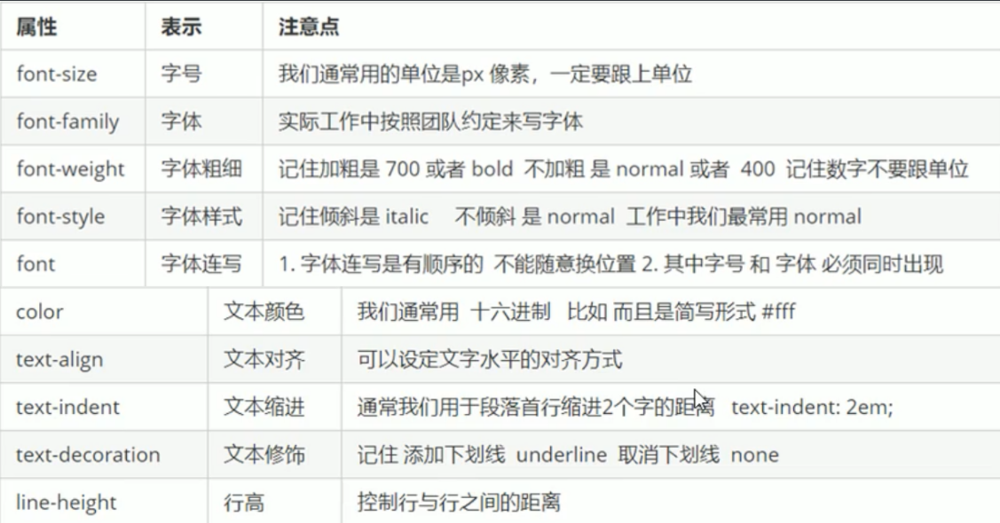

##### 1 字体系列

```css
/*可以选择多个字体，使用','分割，如果字体有空格可以使用''包裹；多字体会按照顺序匹配*/
/*通常不指定字体，使用系统默认字体以保证在任意浏览器中都能正确显示*/
/*如果使用通常使用'body'标签选择器指定整个页面的字体*/
font-family: 'Courier New', Courier, monospace;
```

##### 2 字体大小

```css
/*谷歌浏览器默认文字大小为16px，通常设置以保证任意浏览器中文字大小一致*/
/*通常使用body标签选择器指定整个页面字体大小，注意标题较为特殊需要单独指定大小*/
font-size: 12px;
```

##### 3 字体粗细

```css
/*可以指定数字，最常使用，400为正常*/
/*normal：正常字体，相当于400*/
/*bold：粗体，相当于700*/
/*bolder：特粗体*/
/*lighter：细体*/
font-weight: bold;
```

##### 4 文字样式

```css
/*normal：正常的；italic：斜体*/
font-style: italic;
```

##### 5 字体的复合属性

```css
/*格式：font: font-style font-weight font-size/line-height font-family;*/
/*书写顺序不可以更换，各个属性之间使用空格分隔*/
/*不需要的属性可以省略，但是font-size和font-family必须保留，否则不生效*/
font: italic 700 16px/10px Microsoft Yahei;
```

##### 6 文本颜色

```css
color: #000;
```


##### 7 文本对齐

```css
/*left；center；right*/
text-align: content;
```

##### 8 文本装饰

```css
/*none：默认，没有装饰线，最常用(去除a标签的下划线)*/
/*underline：下划线，a标签自带，最常用*/
/*overline：上划线，几乎不用*/
/*line-through：删除线，几乎不用*/
text-decoration: underline;
```

##### 9 文本缩进

```css
/*通常是将段落的首行缩进，可以为负值，单位可以为px、em*/
/*em：是一个相对单位，即为当前元素一个文字的大小，如果当前元素没有设置则取父元素一个文字大小*/
p {
    text-indent: 2em;
}
```

##### 10 行间距

```css
line-height: 50px;
```


##### 11 小结


