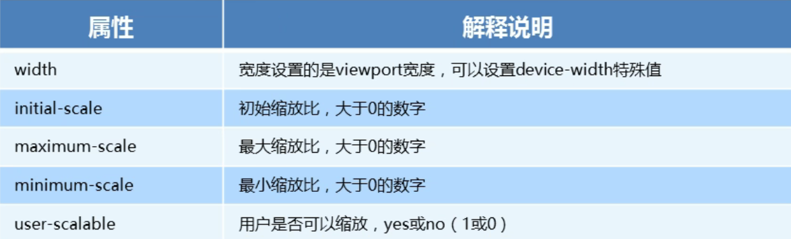

##### 1 meta视口标签

```html
<meta name="viewport" content="width=device-width, user-scalable=no, initial-scale=1.0, maximum-scale=1.0, minimum-scale=1.0">
```



##### 2 物理像素和物理像素比

- 物理像素：屏幕显示的最小的点，是真实存在的，比如`PC`端常见的屏幕为`1920*1080`，`iPhone8`的屏幕为`1334*750`
- `PC`端页面`1px`就等于一个物理像素，但是移动端则不一定相等
- `1px`能够显示的物理像素点的个数就称为物理像素比或屏幕像素比

##### 3 多倍图

- 一张图片在移动设备中会根据物理像素比方法倍数，可能会造成图片的模糊
- 在`viewport`的设置中使用倍图来提高图片的质量，解决图片在高分辨率移动设备中的模糊显示问题
- 通常使用二倍图（`iPhone4/4s`开始苹果设备使用的都是二倍图）

##### 4 二倍精灵图

不能直接测量出图片坐标后使用`background`属性圈出图片后再使用`background-size`缩放图片大小，因为`background-size`缩放的对象是精灵图

1. 将精灵图等比例缩小，缩小到圈出的图片的大小等于页面图片的大小
2. 根据图片在页面中实际的大小圈出图片并得到坐标
3. `background-size`的值设置为精灵图缩小之后的值（注意是精灵图）

##### 5 特殊样式

```css
* {
    /*CSS3盒子模型*/
    box-sizing: border-box;
    -webkit-box-sizing: border-box;
    /*清除点击高亮*/
    -webkit-tap-highlight-color: transparent;
}
input {
    /*清除IOS输入框和按钮的默认样式*/
    -webkit-appearance: none;
}
img, a {
    /*禁用长按弹出*/
    -webkit-touch-callout: none;
}
```

##### 6 常用初始化样式

```css
body {
    margin: 0 auto;
    max-width: 540px;
    min-width: 320px;
    font: normal 14px/1.5 -apple-system, Helvetica, sans-serif;
    color: #000;
    background-color: #f2f2f2;
    overflow-x: hidden;
    -webkit-tap-highlight-color: transparent;
}
```

