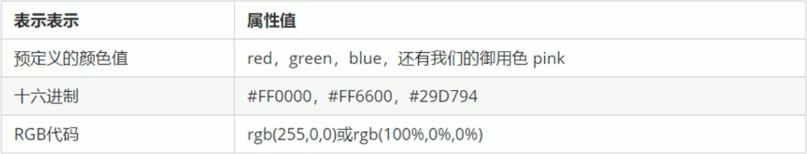

##### 1 字体系列

- 可以选择多个字体，使用','分割，如果字体有空格可以使用''包裹；多字体会按照顺序匹配
- 通常不指定字体，使用系统默认字体以保证在任意浏览器中都能正确显示
- 如果使用通常使用'body'标签选择器指定整个页面的字体

```css
body {font-family: 'Courier New', Courier, monospace;}
```

##### 2 字体大小

- 谷歌浏览器默认文字大小为`16px`，通常设置以保证任意浏览器中文字大小一致
- 通常使用`body`标签选择器指定整个页面字体大小，注意标题较为特殊需要单独指定大小

```css
/*将页面所有文字大小设置为12px*/
body {font-size: 12px;}
```

##### 3 字体粗细

- 可以指定数字，最常使用，400为正常
- `normal`：正常字体，相当于400
- `bold`：粗体，相当于700
- `bolder`：特粗体
- `lighter`：细体

```css
/*将页面所有文字设置为特粗体*/
body {font-weight: bold;}
```

##### 4 文字样式

- `normal`：正常
- `italic`：斜体

```css
/*将页面所有文字设置为斜体*/
body {font-style: italic;}
```

##### 5 字体的复合属性

- 格式：`font: font-style font-weight font-size/line-height font-family`
- 书写顺序不可以更换，各个属性之间使用空格分隔
- 不需要的属性可以省略，但是`font-size`和`font-family`必须保留，否则不生效
- 注意行高可以不写单位，如`15px/1.5`表示行高为字体的1.5倍，如果子元素没有设置行高则会继承这个1.5倍的行高

```css
/*将页面所有文字设置为 斜体、正常大小、16像素、行高10像素、字体为微软雅黑*/
body {font: italic 700 16px/10px Microsoft Yahei;}
```

##### 6 文本颜色

```css
body {color: #000;}
```



##### 7 文本对齐

`left`：左对齐

`center`：居中对齐

`right`：右对齐

```css
/*将页面所有文字设置为居中对齐*/
body {text-align: center;}
```

##### 8 文本装饰

- `none`：默认，没有装饰线，最常用(去除a标签的下划线)
- `underline`：下划线，a标签自带，最常用
- `overline`：上划线，几乎不用
- `line-through`：删除线，几乎不用

```css
/*将页面所有文字设置为带下划线*/
body {text-decoration: underline;}
```

##### 9 文本缩进

- 通常是将段落的首行缩进，可以为负值，单位可以为`px、em`
- `em`：是一个相对单位，即为当前元素一个文字的大小，如果当前元素没有设置则取父元素一个文字大小

```css
/*所有段落首行缩进2个文字*/
p {text-indent: 2em;}
```

##### 10 行间距

```css
body {line-height: 50px;}
```


##### 11 小结


