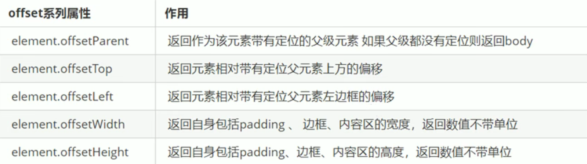
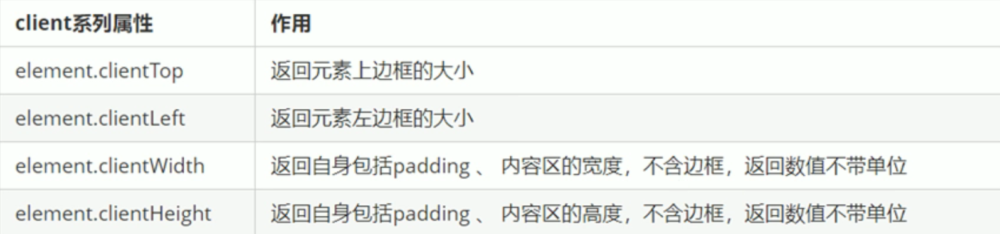
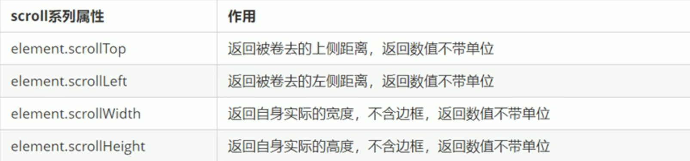
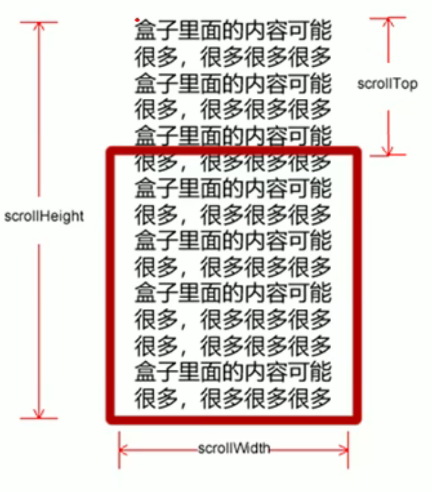

#####  1 offset

`offset`就是偏移量，使用`offset`系列相关属性可以动态得到元素的位置（偏移），大小等

**offset与style的区别**

`offset`

1. 可以得到任意样式表中的样式值
2. 获得的数值没有单位
3. `offsetWidth`和`offsetHeight`的值是`width+padding+border`的和
4. `offsetWidth`等属性是只读属性
5. 如果想要获取元素的位置、大小等，使用`offset`系列更合适

`style`

1. 只能得到行内样式中的属性
2. 获得的数值带单位
3. `style.width`和`style.height`的值不包括`padding`和`border`
4. `style.width`等属性是可读写属性
5. 如果想要更改元素的相关属性，则需要使用`style`

##### 2 client

`client`系列的相关属性可以用于获取元素可视区的相关信息，比如元素的边框大小、元素大小等

###### 3 scroll

`scroll`系列的相关属性可以用于获取元素的大小、滚动距离等

##### 4 三者的区别

- `offst`系列常用于获取元素的位置
- `client`系列常用于获取元素的大小
- `scroll`系列常用于获取滚动距离
- 页面的滚动距离通过`window.pageYOffset`
