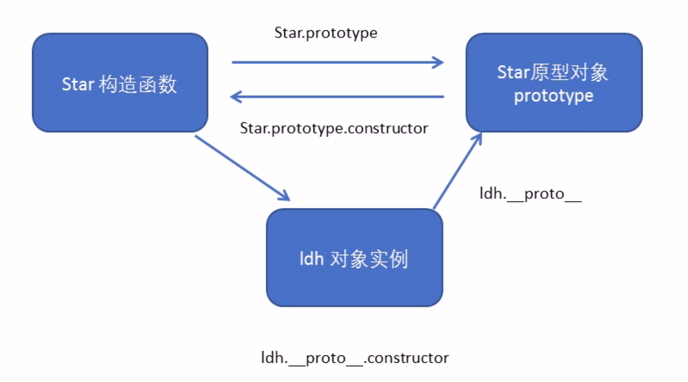
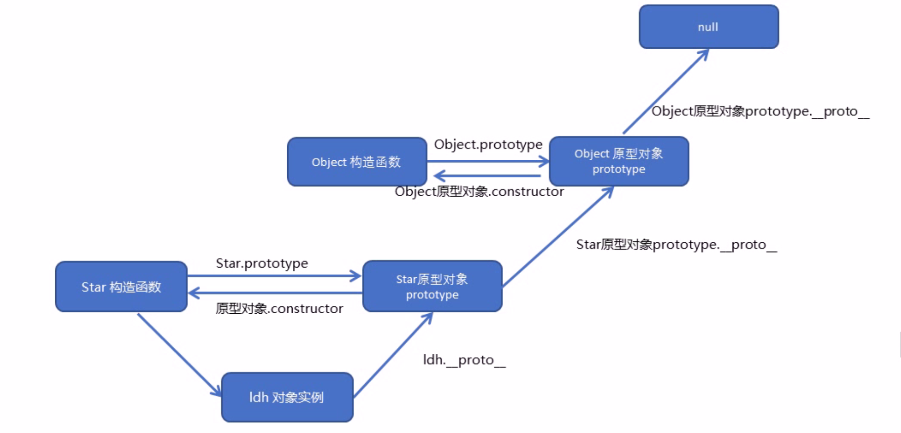

##### 1 构造函数简介

在`ES6`之前，`JS`并没有引入类的概念，而是使用构造函数来定义对象和他们的特征

注意事项

- 构造函数一般用于创建某一类对象
- 应遵守首字母大写的规范
- 创建对象时使用`new`关键字

`new`关键字的执行过程

1. 内存空开辟空间创建空对象
2. `this`指向空对象
3. 执行构造函数中的代码，完成属性和方法的赋值
4. 返回创建完成的对象

```js
function Star(uname,age) {
    this.uname = uname;
    this.age = age;
    this.sing = function () {
        console.log('sing')
    };
}

var star1 = new Star('张学友', 20);
var star2 = new Star('刘德华', 20);
console.log(star1.uname, star1.age);//张学友 20
console.log(star2.uname, star2.age);//刘德华 20
star1.sing()//sing
star2.sing()//sing
```

##### 2 静态成员和实例成员

静态成员：在构造函数本身添加的属性和方法称为静态成员，只能由构造函数本身访问

实例成员：在构造函数内部赋值的属性和方法称为实例成员，只能由实例化后的对象访问

```js
function Star(uname) {
    this.uname = uname;
    this.sing = function () {
        console.log('sing')
    };
}
Star.gender = '男';
Star.starSing = function () {
    console.log('Star sing')
};

var star = new Star('张学友');
//访问实例成员
console.log(star.uname);
star.sing();
//访问静态成员
console.log(Star.gender)
Star.starSing();
```

##### 3 构造函数的问题

构造函数的方法会存在浪费内存的问题：构造函数的不同实例对象使用的不是同一个方法，我们知道在大多数`OOP`语言中，一个类的多个实例使用的是同一个方法

```js
function Star(uname) {
    this.uname = uname;
    this.sing = function () {
        console.log('sing')
    };
}

var star1 = new Star('张学友');
var star2 = new Star('刘德华');
console.log(star1.sing === star2.sing)//false
```

##### 4 prototype原型（原型对象）

`JS`规定每一个构造函数都有一个`prototype`属性，指向另一个对象，这个对象的所有属性和方法都会被构造函数所拥有

我们可以将方法直接定义在`prototype`对象上，这样所有实例对象就可以共享这些方法

一般情况下我们将属性定义在构造函数中，将方法定义在原型对象中

```js
function Star(uname) {
    this.uname = uname;
}

Star.prototype.sing = function () {
    console.log(this.uname + 'sing')
};
var star1 = new Star('张学友');
var star2= new Star('刘德华');
star1.sing();//张学友sing
star2.sing();//刘德华sing
console.log(star1.sing === star2.sing)//true
```

##### 5 \__proto__对象原型

每一个对象实例都有一个`__proto__`属性，这个属性指向构造函数的原型对象`prototype`，我们之所以可以通过对象实例调用构造函数的原型对象`prototype`中的成员（属性和方法），就是因为对象实例有原型`__proto__`的存在。

所以构造函数的原型对象`prototype`和实例的原型`__proto__`是等价的

```js
function Star(uname) {
    this.uname = uname;
}
Star.prototype.sing = function () {
    console.log(this.uname + 'sing')
};

var star = new Star('张学友');
console.log(star.__proto__ === Star.prototype);//true
```

查找成员的规则：首先查看实例本身是否有指定的成员，如果没有则会去实例的`__proto__`原型（也就是构造函数的原型对象`prototype`）上查找指定的成员。所以对象原型`__proto__`存在的意义就是为对象成员的查找提供一条线路。

注意：对象原型`__proto__` 只是为实例的成员查找提供了一个指针，但是它不是一个标准属性，因此实际开发中不应当使用这个属性。

###### 6 constructor构造函数

构造函数的原型对象`prototype`和实例的原型`__proto__` 中都有一个`constructor`属性，这个属性指回构造函数本身

`constructor`主要用于记录对象实例由哪个构造函数创建，原型对象`prototype`属于哪个构造函数

```js
function Star(uname) {
    this.uname = uname;
}
Star.prototype.sing = function () {
    console.log(this.uname + 'sing')
};

var star = new Star('张学友');
console.log(Star.prototype.constructor === Star);//true
console.log(star.__proto__.constructor === Star);//true
```

在一些情况下我们需要手动使用`constructor`这个属性，将构造函数的`prototype`原型对象的`constructor`属性指回构造函数

如果我们将构造函数的`prototype`原型对象重新赋值，必须手动将该原型对象的`constructor`指回构造函数本身

```js
function Star(uname) {
    this.uname = uname;
}

Star.prototype = {
    constructor: Star, //如果没有这一行，那么这个构造函数的prototype原型对象的constructor属性就无法指回构造函数本身，这意味着这个构造函数的prototype原型对象无法再找回自身属于哪个构造函数；同样的对象本身也无法知道自己是由哪个构造函数创建的，因为对象是通过__proto__对象原型与构造函数的prototype原型对象相关联的
    sing: function () {
        console.log(this.uname + 'sing')
    },
    movie: function () {
        console.log(this.uname + 'movie')
    }
}
```



##### 7 原型链

对象实例的成员查找机制

1. 首先查看实例自身有没有该成员
2. 如果没有就查看实例的原型`__proto__`中有没有该成员
3. 还没有就查找原型的原型
4. 直至找到`Object`的原型对象`prototype`为止（`null`）

```js
function Star(uname) {
    this.uname = uname;
}

console.log(Star.prototype.__proto__ === Object.prototype);//true
console.log(Object.prototype.__proto__)//null
```


